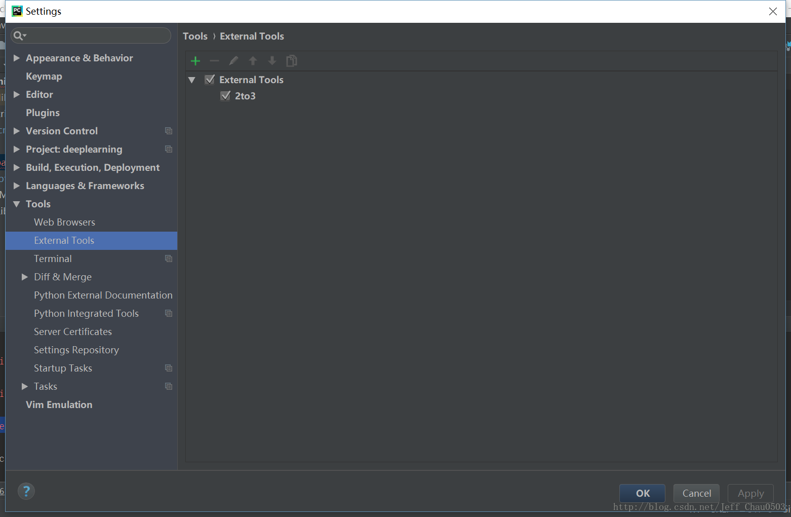

## block hash

------

> 该项目是用于计算比特币中的区块hash，使用python语言。

### requirement

python 3.7 or 2.7

### explain

blockhash.py是用python3写的，blockhash_python2.py 则是python2。由于在python3中prev_block.decode("hex")已失效，需要使用codesc库来代替

~~~python
import codecs    # 由于 'hello'.encode("hex") 只适用python2，故python3使用该库

# prev_block.encode()  将字符串转为字节  b'adb'
codecs.getdecoder('hex')(prev_block.encode())[0]  # 等价于python2中的prev_block.decode("hex")
codecs.getencoder('hex')(prev_block.encode())[0]  # 等价于python2中的prev_block.encode("hex")
~~~

### source

```python
# 数据获取途径：https://blockchain.info/rawblock/000000000000000000003306eff4d5ac9f94a69507c4fd3348107af23de3dfcc
# 网页打开第一行即可获得确切的ver 和 time bitx 和nonce(这四个皆是10进制，默认大端对齐)


# 打开 https://btc.com/000000000000000000003306eff4d5ac9f94a69507c4fd3348107af23de3dfcc 即可看到前个区块的hash和本区块的梅克尔树根
```

### references

作者：shooter

链接：https://www.jianshu.com/p/4187a7352769

来源：简书

> ## hash block in python2
>
> bitcoin的创世块的数据是以 hard code的形式写在源码里,
>  之后的block hash都是通过固定的方式计算出来的. 怎么计算出来呢?
>
> 每一个block都有:
>  `version` 即网络节点的版本号
>  `prev_block` 前一个块的hash,创世块没有,以后的块都有
>  `mrkl_root`,  是 [Merkle tree](https://www.jianshu.com/p/4e08d0d037a6), 即默克尔树
>  `time` 即时间戳,当前时间
>  `bits` 网络的难度
>  `nonce` 随机数
>
> 这个 **nonce 就是 Pow 要计算的随机量**, 区别是要计算2次hash.
>  先把 `version prev_block mrkl_root time bits nonce`当做字符串合并到一起, 得到结果 `result`. 得到 `result` 后,  做2次 sha256运算,  得到 `hash`, 再然后`hash` 做大小端转换, 最后的结果就是这个block的hash.
>
> 不过 `version time bits nonce` 要转换为 unsigned long型小字端,
>  `prev_block mrkl_root` 要转换为16进制并大小端转换, 这一步确实很麻烦.
>
> ------
>
> 测试下 `height=1` 的 block hash值
>
> ```bash
> curl https://blockchain.info/rawblock/00000000839a8e6886ab5951d76f411475428afc90947ee320161bbf18eb6048
> 
> {
>   hash: "00000000839a8e6886ab5951d76f411475428afc90947ee320161bbf18eb6048",
>   ver: 1,
>   prev_block: "000000000019d6689c085ae165831e934ff763ae46a2a6c172b3f1b60a8ce26f",
>   mrkl_root: "0e3e2357e806b6cdb1f70b54c3a3a17b6714ee1f0e68bebb44a74b1efd512098",
>   time: 1231469665,
>   bits: 486604799,
>   fee: 0,
>   nonce: 2573394689,
>   n_tx: 1,
>   size: 215,
>   block_index: 14850,
>   main_chain: true,
>   height: 1
> 
>   ......
> }
> ```
>
> #### python script
>
> ```python
> import hashlib
> import struct
> 
> ver = 1
> prev_block = "000000000019d6689c085ae165831e934ff763ae46a2a6c172b3f1b60a8ce26f"
> mrkl_root = "0e3e2357e806b6cdb1f70b54c3a3a17b6714ee1f0e68bebb44a74b1efd512098"
> time = 1231469665
> bits = 486604799
> nonce = 2573394689
> 
> hex_str = struct.pack("<L", ver) + prev_block.decode('hex')[::-1] +\
>   mrkl_root.decode('hex')[::-1] + struct.pack("<LLL", time, bits, nonce)
> 
> hash_str = hashlib.sha256(hashlib.sha256(hex_str).digest()).digest()
> # 这就是bitcoin矿机的工作 , 找到一个合适的nonce  
> # 使得做2次sha256运算的结果符合某个条件
> 
> block_hash = hash_str[::-1].encode('hex_codec')
> ```
>
> ------
>
> **挖矿做的工作**
>
> 在一个block的结构中,  `version prev_block mrkl_root time bits`都是很容易计算的. 只有 `nonce`这个随机数不确定.
>
> bitcoin的 pow 就是 找到一个合适的 `nonce`,  使得 `version prev_block mrkl_root time bits nonce`合并的结果 `reuslt`,再经过2次sha256计算, 达到一个符合bitcoin网络难度的数值. bitcoin的网络难度通过 bits计算, 难度即最后计算的hash的前n位是零.
>
> 每一个block hash的计算, 都包含了prev_block_hash,这也是链的体现, 增加了攻击bitcoin的难度. 如果有人改了一个block的hash, 这个块之后的所有的块hash都要重新计算.
>
> ### python 处理字节序
>
> #### 获取字节顺序
>
> ```python
> import sys
> 
> endianness = sys.byteorder
> print("system Endianness is "+ endianness)
> ```
>
> #### 大小端转换
>
> ```python
> "6fe28c0ab6f1b372c1a6a246ae63f74f931e8365e15a089c68d6190000000000".decode('hex')[::-1].encode('hex_codec') 
> #=> 000000000019d6689c085ae165831e934ff763ae46a2a6c172b3f1b60a8ce26f
> ```
>
> [000000000019d6689c085ae165831e934ff763ae46a2a6c172b3f1b60a8ce26f](https://btc.com/000000000019d6689c085ae165831e934ff763ae46a2a6c172b3f1b60a8ce26f)
>
> ```ruby
> import struct
> 
> ver = 1
> prev_block = "000000000019d6689c085ae165831e934ff763ae46a2a6c172b3f1b60a8ce26f"
> mrkl_root = "0e3e2357e806b6cdb1f70b54c3a3a17b6714ee1f0e68bebb44a74b1efd512098"
> time = 1231469665
> bits = 486604799
> nonce = 2573394689
> 
> struct.pack("<L", ver) #转换为 unsigned long型小端
> prev_block.decode('hex')[::-1] # 转换为16进制并大小端转换
> mrkl_root.decode('hex')[::-1] # 转换为16进制并大小端转换
> struct.pack("<LLL", time, bits, nonce) # 把3个变量转换为 unsigned long型小端
> ```
>
> #### struct
>
> 在struct中有以下几种字节顺序
>
> | Character | Byte order             | Size     | Alignment |
> | --------- | ---------------------- | -------- | --------- |
> | @         | native                 | native   | native    |
> | =         | native                 | standard | none      |
> | <         | little-endian          | standard | none      |
> | >         | big-endian             | standard | none      |
> | !         | network (= big-endian) | standard | none      |
>
> | 字符 | 字节顺序   | 尺寸 | 对齐方式 |
> | ---- | ---------- | ---- | -------- |
> | @    | 本机       | 本机 | 本机     |
> | =    | 本机       | 标准 | 无       |
> | <    | 小端       | 标准 | 无       |
> | >    | 大端       | 标准 | 无       |
> | ！   | 网络即大端 | 标准 | 无       |
>
> 数据格式
>
> | Format | C Type         | Python type       | Standard size | Notes    |
> | ------ | -------------- | ----------------- | ------------- | -------- |
> | x      | pad byte       | no value          |               |          |
> | c      | char           | bytes of length 1 | 1             |          |
> | b      | signed char    | integer           | 1             | (1),(3)  |
> | B      | unsigned char  | integer           | 1             | (3)      |
> | ?      | _Bool          | bool              | 1             | (1)      |
> | h      | short          | integer           | 2             | (3)      |
> | H      | unsigned short | integer           | 2             | (3)      |
> | i      | int            | integer           | 4             | (3)      |
> | I      | unsigned int   | integer           | 4             | (3)      |
> | l      | long           | integer           | 4             | (3)      |
> | L      | unsigned long  | integer           | 4             | (3)      |
> | q      | long long      | integer           | 8             | (2), (3) |
> | Q      | unsigned long  |                   |               |          |
> | long   | integer        | 8                 | (2), (3)      |          |
> | n      | ssize_t        | integer           |               | (4)      |
> | N      | size_t         | integer           |               | (4)      |
> | e      | (7)            | float             | 2             | (5)      |
> | f      | float          | float             | 4             | (5)      |
> | d      | double         | float             | 8             | (5)      |
> | s      | char[]         | bytes             |               |          |
> | p      | char[]         | bytes             |               |          |
> | P      | void *         | integer           |               | (6)      |
>
> | 字符 | C类型              | python类型    | 标准尺寸 |
> | ---- | ------------------ | ------------- | -------- |
> | x    | 填充字节           | 没有意义的值  |          |
> | c    | char               | 长度为1的字节 | 1        |
> | b    | signed char        | 整型          | 1        |
> | B    | unsigned char      | 整型          | 1        |
> | ？   | _Bool              | 布尔          | 1        |
> | h    | short              | 整型          | 2        |
> | H    | unsigned short     | 整型          | 2        |
> | i    | int                | 整型          | 4        |
> | I    | unsigned int       | 整型          | 4        |
> | l    | long               | 整型          | 4        |
> | L    | unsigned long      | 整型          | 4        |
> | q    | long long          | 整型          | 8        |
> | Q    | unsigned long long | 整型          | 8        |
> | n    | ssize_t            | 整型          |          |
> | N    | size_t             | 整型          |          |
> | e    |                    | 浮动          | 2        |
> | f    | float              | 浮动          | 4        |
> | d    | double             | 浮动          | 8        |
> | s    | char[]             | 字节          |          |
> | p    | char[]             | 字节          |          |
> | P    | void *             | 整型          |          |
>
> ------
>
> 


### generally trans python2 to python3

利用python内置工具2to3.py自动将python2的代码转换为python3的代码，该脚本python2和python3都有，位于python的安装根目录\Tools\Scripts\2to3.py。


如转换python2.x的python脚本：  D:\tmp\hello.py，

进入cmd，输入   python xx\Tools\Scripts\2to3.py -w D:\tmp\hello.pyhello.py

==注意，该工具只能从语法层面上转换，若python3中原python2的部分方法失效，会报错，无法运行==

> #### 在pycharm中配置从Python2.x到3.x的转换工具
>
> 原文链接：https://blog.csdn.net/Jeff_Chau0503/java/article/details/79234735
>
> 
>
> 第一步： File--Setting--Tools--External Tools.--点击如下图中绿色的加号。如果你是第一次添加外部工具，这里是空白的，没有下图的 External Tools 和 2to3
>
> 
>
> 第二步：设置
>
> 
>
> Programm：这里我设置为python所在的目录，
>
> Arguments：由于python自带2to3转换工具，这里不同于其他大佬的博文，需要填入工具所在的位置。注意！这里要加上 -w  ，意思为 Write back modified files. 即将原始2.x版本的代码重命名为 原始文件名+.bak的形式。后面的$FilePath$代表原始文件的绝对路径。
>
>
> Working directory: $FileDir$代表原始文件所在目录的的绝对路径。
>
> 完成后点击OK。
>
> 
>
> 第三步：
>
> 右击你需要转换的.py文件，选择External Tools --- 2to3
>
> 大功告成！你会在目录栏看到一个新的原文件名.py.bak的文件。这个为你转换前的原始文件。