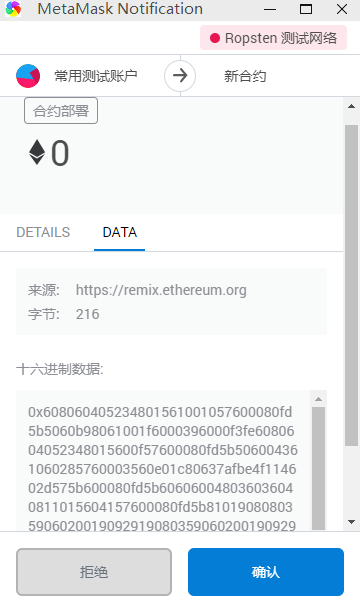

# 基于以太坊的智能合约开发

> 参考链接： [以太坊开发入门，Remix IDE使用及简单的合约部署](https://blog.csdn.net/Lyon_Nee/article/details/91046159?utm_medium=distribute.pc_relevant.none-task-blog-BlogCommendFromMachineLearnPai2-1.channel_param&depth_1-utm_source=distribute.pc_relevant.none-task-blog-BlogCommendFromMachineLearnPai2-1.channel_param)

[](https://travis-ci.org/avelino/awesome-go) [](https://github.com/sindresorhus/awesome) [](http://gophers.slack.com/messages/awesome) [](https://app.netlify.com/sites/awesome-go/deploys)

## 准备：

- chrome浏览器打开 [remix](https://remix.ethereum.org/)网站，智能合约开发 IDE，有离线版
- [MetaMask](https://metamask.io/download.html) 以太坊钱包，浏览器插件

### 离线版 Remix安装(可选)

> 原文链接： [Remix 以太坊Solidity IDE搭建与初步使用](https://blog.csdn.net/jerry81333/article/details/78118972?utm_medium=distribute.pc_relevant.none-task-blog-BlogCommendFromMachineLearnPai2-2.channel_param&depth_1-utm_source=distribute.pc_relevant.none-task-blog-BlogCommendFromMachineLearnPai2-2.channel_param)

1. 安装Remix：
官方地址: https://github.com/ethereum/browser-solidity

~~~shell
git clone https://github.com/ethereum/browser-solidity
cd browser-solidity
npm install
npm run prepublish
npm start  # 启动remix
~~~


访问Remix： [http://127.0.0.1:8080](http://127.0.0.1:8080)  界面如下：


至此，Remix算是配置完成了。

2. 初步使用：
1.当前的solidity版本，如上图截图所示为0.4.9，这个默认用的是当前最新的release版本：


2. 点击下拉框，可以选择不同的版本，包括还未成熟的最新构建版本，或者是之前的版本等。 选择release版本，如下图所示的这些 ：


3. 合约自动编译后生成:


4. 点击create,会在内存中将该智能合约创建一个实例，即将下面的web3 deploy代码部署在虚拟的内存中: 

   


### MetaMask 钱包插件使用

选中 Ropsten 测试网络


> 如果没有账户的话需要先新建个账户，输入密码，如我的:
>
> 0x92a2b455bde5B729e604eAEEa082377eBaD404cc
>
> 123456
>
> 对应私钥：5bdf09b7274f73eb3fbc1346e639ec362eec5dae6e7cf419fce09687d0747dfe

获取测试网络 Rosptan 的以太币


点击后会打开 https://faucet.metamask.io 网页，再该网页真正的获取以太币


三笔交易都可通过交易id在 [https://ropsten.etherscan.io](https://ropsten.etherscan.io/tx/0x621aaf7b3540116c3e6b3a7c5c4bd0da88575df7f8fcac1e943cb48bee2ccb85) 上查看，可能需要**科学上网**。

查询格式 https://ropsten.etherscan.io/tx/0x621aaf7b3540116c3e6b3a7c5c4bd0da88575df7f8fcac1e943cb48bee2ccb85


## 使用在线 Remix测试 简单合约

打开在线 [remix](https://remix.ethereum.org/#optimize=false&evmVersion=null&version=soljson-v0.6.6+commit.6c089d02.js) 页面如下


点击 箭头所指的 "New File"新建合约文件

### 编写合约 && 编译合约


> 编译出错时，运行结果区会有出错提示

### 部署合约

编译完合约后就可以进行部署，环境有三种

- JavaScript VM：可直接测试，不用连接metamask和测试链/私有链
- Injected Web3：调用合约，metamask会弹出确认框，需要先开启私有链或连接Ropsten测试网络
- Web3 Provider：很少用


点击部署，测试合约中的add方法，结果如下

> 如果选择的时 Injected Web3 会先弹出 确认框，点击确认后才能执行
>
> 
>
> https://ropsten.etherscan.io/tx/0xc3084d3a12c795d4285ed4eebc46de86b5515cf2eb827961efdce8d3a3bb82f6
>
> 不久，右小角会弹出MetaMask的提示框，提示执行结果；正下方也会输出执行的交易详情。


左下角 无法打开查看合约中的所有函数时，需要**科学上网**

## solidity学习

>  原文连接 [solidity学习记录（二）基础操作整理](https://blog.csdn.net/weixin_45067603/article/details/105738788)

### 基本数据类型和运算

#### 1.solidity的四种可见度/访问权限

> public：任何人都可以调用该函数，包括DApp的使用者。
> private：只有合约本身可以调用该函数（在另一个函数中）。
> internal：只有这份合同以及由此产生的所有合同才能称之为合同。
> external：只有外部可以调用该函数，而合约内部不能调用。

#### 2.solidity的三种修饰符

> view: 可以自由调用，因为它只是“查看”区块链的状态而不改变它
> pure: 也可以自由调用，既不读取也不写入区块链
> payable:常常用于将代币发送给合约地址。

来源自[solidity[1\]-HelloWorld](https://blog.csdn.net/weishixianglian/article/details/84034707)

#### 3.一个solidity的函数应有以下部分组成

function
你的函数名字(类型1 名字,类型2 名字，。。。,类型n 名字) **如果没有就什么都不填即可**
可见度/访问权限，即public/private/internal/external **如果不写则系统默认为public并且警告**
修饰符，即view/pure/payable **如果需要花费gas则不写**
returns(类型1 名字,类型2 名字，。。。,类型n 名字) **PS.如果有的话**

注意：调用函数时如果需要输入字符串，则在输入框之内需要将字符串用双引号括起来。
尝试了一下最新的网页版不加双引号也可以成功，可能是更新之后新增的功能，具体见图

```javascript
pragma solidity ^0.4.0;

contract helloworld {
    function stringtest(string inputstr) public view returns(string){
        return inputstr;
    }
}
1234567
```


#### 4.布尔类型

```javascript
pragma solidity ^0.4.0;

contract helloworld {
    bool boola=true; //声明一个布尔类型的值，只用一个等号
    function booltesta() public view returns(bool){
        return boola;
    }
    
    function booltestb(int a,int b) public view returns(bool){
        return a==b;
    }
}
123456789101112
```

测试结果


#### 5.与，或

即&&，||

```javascript
pragma solidity ^0.4.0;

contract helloworld {
    function andtestTT() public view returns(bool){
        return true&&true;
    }
    function andtesTF() public view returns(bool){
        return true&&false;
    }
    function andtestFF() public view  returns(bool){
        return false&&false;
    }
    function ortestTT() public view returns(bool){
        return true||true;
    }
    function ortesTF() public view  returns(bool){
        return true||false;
    }
    function ortestFF() public view  returns(bool){
        return false||false;
    }
}
12345678910111213141516171819202122
```

测试结果


#### 6.通常运算符

即+，-，*，/，%以及特殊的符号**代表x的x次幂

```javascript
pragma solidity ^0.4.0;

contract helloworld {
     function jiatest(int a,int b) public view  returns(int){
        return a+b;
    }
    function jiantest(int a,int b)  public view returns(int){
        return a-b;
    }
    function chengtest(int a,int b) public view  returns(int){
        return a*b;
    }
    function chutest(int a,int b)  public view returns(int){
        return a/b;
    }
    function quyutest(int a,int b)  public view returns(int){
        return a%b;
    }
    function mitest(uint a,uint b)  public view returns(uint){
        return a**b; //此处必须为uint，直接写int256会报错
    }
}
12345678910111213141516171819202122
```

测试结果


#### 7.位运算符

1.& 操作数之间转换成二进制之后每位进行与运算操作（同1取1）
2.| 操作数之间转换成二进制之后每位进行或运算操作（有1取1）
3.~ 操作数转换成二进制之后每位进行取反操作（直接相反）
4.^ 操作数之间转换成二进制之后每位进行异或操作（不同取1）
5.<<操作数转换成二进制之后每位向左移动x位的操作
6.>>操作数转换成二进制之后每位向右移动x位的操作
举例

```javascript
pragma solidity ^0.4.0;

contract helloworld {
    function Wyutest(uint8 a,uint8 b)  public view returns(uint8){
        return a&b;
    }
    function Whuotest(uint8 a,uint8 b)  public view returns(uint8){
        return a|b;
    }
    function Wfantest(uint8 a)  public view returns(uint8){
        return ~a;
    }
    function Wyihuotest(uint8 a,uint8 b)  public view returns(uint8){
        return a^b;
    }
    function zuoyitest(uint8 a,uint8 b)  public view returns(uint8){
        return a<<b;
    }
    function youyitest(uint8 a,uint8 b)  public view returns(uint8){
        return a>>b;
    }
}
12345678910111213141516171819202122
```

运行结果


#### 8.solidity中赋值

solidity是先将赋值语句之中所有的都计算出来之后再进行赋值操作的
举例

```javascript
pragma solidity ^0.4.0;

contract helloworld {
    function setvaluetest() public view returns(uint8){
        return 9999999999999999999-9999999999999999998;
    }
}
1234567
```

测试结果

<div align=center>
    
#### 9.固定长度字节数组byte

一个byte=8个位（XXXX XXXX）X为0或1，二进制表示
byte数组为bytes1，bytes2，。。。，bytes32，以八个位递增，即是对**位的封装**
举例
bytes1=uint8
bytes2=unit16
。
。
。
bytes32=unit256

##### 使用byte数组的理由：

1.bytesX可以更好地显示16进制
举例：bytes1=0x6A，bytes1=（XXXX XXXX）正好四个表示一个16进制，以此类推
2.bytes数据声明时加入public可以自动生成调用长度的函数，见下

```javascript
pragma solidity ^0.4.0;

contract helloworld {
    bytes1 public num1 = 0x12;  
    bytes4 public num2 = 0x12121212;
}
123456
```


3.bytes内部**自带length**长度函数，而且**长度固定**，而且**长度不可以被修改**。见下

```javascript
pragma solidity ^0.4.0;

contract helloworld {
    bytes1 public num1 = 0x12;  
    bytes4 public num2 = 0x12121212;
    function getlength1() public view returns(uint8){
        return num1.length;
    }
    function getlength2() public view returns(uint8){
        return num2.length;
}
1234567891011
```


4.字节数组可以进行大小比较

```javascript
pragma solidity ^0.4.0;

contract helloworld {
    bytes1 public num1 = 0x12;  
    bytes4 public num2 = 0x12121212;
    uint8 num3 = 0x12;
    uint8 num4 = 12;
    function compare1() public view returns(bool){
        return num1<num2;
    }
    function compare2() public view returns(bool){
        return num1>num2;
    }
    function compare3() public view returns(bool){
        //return num1>num3;不管是16进制还是二进制，编译器都会报错，
        //return num1>num4;说明无法进行byte和int之间的比较
    }
}
123456789101112131415161718
```

#### 10.可变长度byte数组

声明方法
bytes arr = new bytes(length);
举例

```javascript
pragma solidity ^0.4.0;

contract helloworld {
    
     bytes arr1 = new bytes(3);
    function initarr() public view{
        arr1[0]=0x12;
        arr1[1]=0x34;
    }
    function getarrlength() public view returns(uint){
        return arr1.length;
    }
     function arrchange() public {
        arr1[0]=0x11; //
    }
    
     function arrlengthchange(uint a) public {
        arr1.length=a; //
    }
    
    function pushtest() public {
        arr1.push(0x56);
    }
}
123456789101112131415161718192021222324
```

**其他注意：注意操作时不要出现位溢出的情况，如uint8中的数值超过255或者为负。还有除数为0等等常见错误**